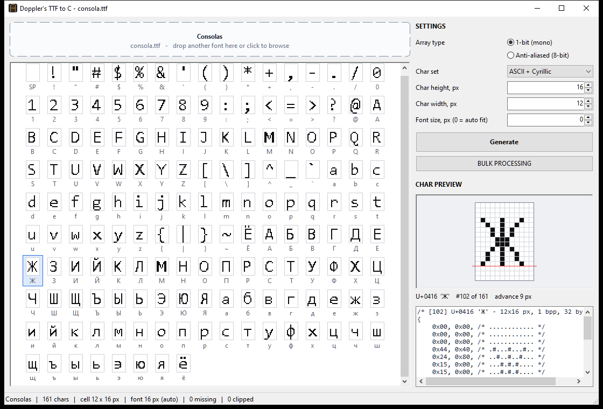

# Doppler's TTF to C

Converts TrueType / OpenType fonts (`.ttf`, `.otf`) into fixed-size C bitmap arrays for LED matrices, LCD and OLED displays.

A single, portable Windows `.exe` with nothing to install. It's written in C++ on Win32 / GDI with no third-party libraries.



## Features

- **Drag & drop** a `.ttf` / `.otf` file into the window, click the drop area to browse, or drop a font onto the exe.
- **Live preview grid** of every char in the set, rendered exactly as it will be exported.
- **Char preview panel**: click a char to see it enlarged on a pixel grid, with the baseline and its C array.
- **1-bit (mono)** or **anti-aliased (8-bit grayscale)** output.
- **Char sets**: Numbers (0-9), ASCII (EN), ASCII + Cyrillic (А–я, Ё, ё).
- **Any cell size** from 1 to 256 px in width and height.
- **Auto-fit font size**: picks the largest size where every char in the set fits the cell. You can also set the size by hand.
- **Missing chars are replaced with spaces** (blank bitmaps) and listed in the output header.
- **Generate**: writes `{FontName}-Code-{YYYYMMDD-HHMMSS}.txt` next to the exe and opens it in your default text editor.
- **Bulk processing**: pick a folder and every font in it is converted with the current settings. The `.txt` files are saved into that same folder.

## Download

Get `DopplersTTFtoC.exe` from the [latest release](../../releases/latest) and run it. Windows 10 / 11, x64.

## Usage

1. Drop a font into the window.
2. Choose the **array type**, **char set**, **char height** and **char width**.
3. Leave **font size** at `0` for auto-fit, or enter a pixel size. With a manual size, ink that falls outside the cell is clipped.
4. Click chars in the grid to check them.
5. Press **Generate**, or **BULK PROCESSING** to convert a whole folder.

## Output format

```c
#include <stdint.h>

#define ARIAL_12X16_WIDTH           12
#define ARIAL_12X16_HEIGHT          16
#define ARIAL_12X16_BPP             1
#define ARIAL_12X16_BYTES_PER_ROW   2
#define ARIAL_12X16_BYTES_PER_CHAR  32
#define ARIAL_12X16_CHAR_COUNT      95
#define ARIAL_12X16_BASELINE        11

static const uint8_t arial_12x16[ARIAL_12X16_CHAR_COUNT][ARIAL_12X16_BYTES_PER_CHAR] = {
    ...
    /* [33] U+0041 'A' */
    {
        0x00, 0x00, /* ............ */
        0x04, 0x00, /* .....#...... */
        0x0A, 0x00, /* ....#.#..... */
        0x11, 0x00, /* ...#...#.... */
        0x1F, 0x00, /* ...#####.... */
        0x20, 0x80, /* ..#.....#... */
        ...
    },
    ...
};

static inline int arial_12x16_index(uint32_t cp);            /* Unicode code point -> index, or -1 */
static inline const uint8_t *arial_12x16_glyph(uint32_t cp); /* Unicode code point -> bitmap, or 0 */
```

- Rows run top to bottom.
- **1 bpp**: the MSB is the leftmost pixel, and each row is padded to whole bytes.
- **8 bpp**: one byte per pixel, from `0x00` (background) to `0xFF` (full ink).
- Every row has an ASCII-art comment, so glyphs can be read directly in the source.
- The header records the font, cell size, font size, baseline, pixel format and any missing chars.
- The output is plain C99 and compiles cleanly with `-std=c99 -pedantic -Wall -Wextra`.

## Building from source

Requires a MinGW-w64 GCC toolchain, e.g. [w64devkit](https://github.com/skeeto/w64devkit).

```bat
set TOOLCHAIN=C:\path\to\w64devkit\bin
build.bat
```

Output: `bin\DopplersTTFtoC.exe`, statically linked, with no runtime DLLs. `TOOLCHAIN` defaults to `C:\workenv\w64devkit\bin`.

| Path | Purpose |
|---|---|
| `src/font_engine.*` | sfnt name parsing, private font loading, glyph rasterizing and cell fitting |
| `src/codegen.*` | C source generation |
| `src/main.cpp` | Win32 UI |
| `res/` | manifest, version info, icon |
| `tools/make_icon.cpp` | regenerates `res/app.ico` if it is deleted |

### How it works

Fonts are loaded privately for this process with `AddFontMemResourceEx`, so nothing is installed. Glyphs are rasterized by GDI's `GetGlyphOutline`: `GGO_BITMAP` gives hinted 1-bit output, and `GGO_GRAY8_BITMAP` gives the anti-aliased output. Both TrueType and CFF-based OpenType outlines are supported.

## Known limitations

- If a font with the same family name is installed system-wide, Windows may render the installed version.
- `.ttc` collections: only the first face is used.

## License

[MIT](LICENSE)
